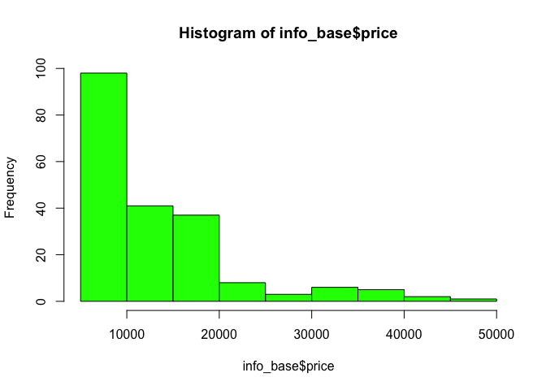
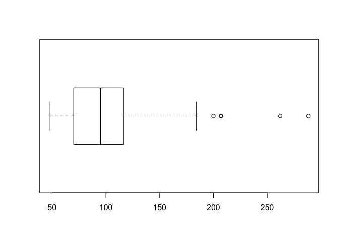
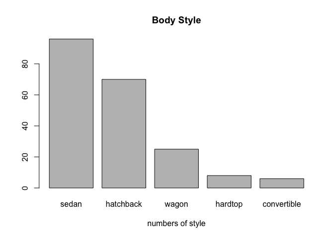
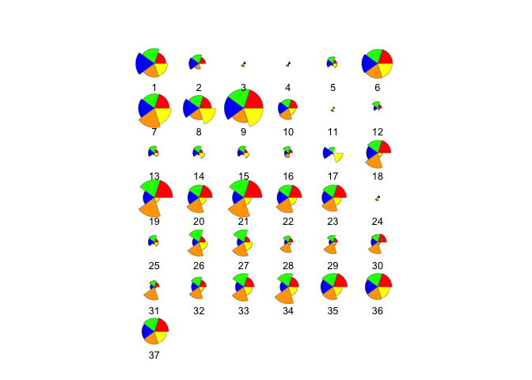
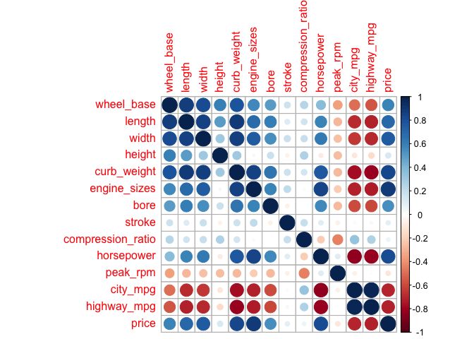
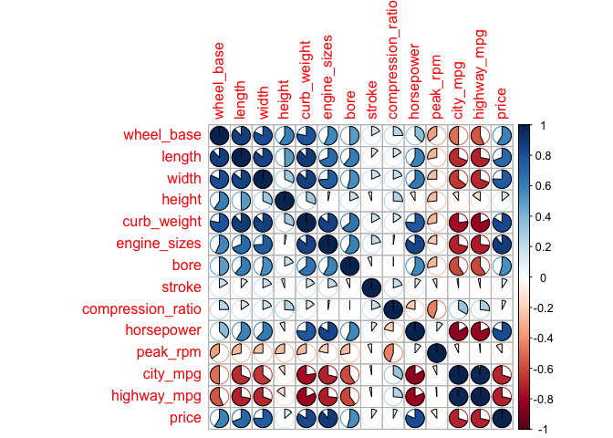
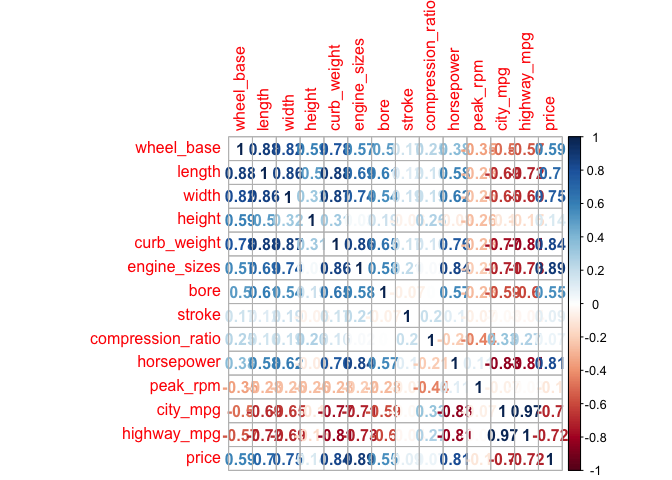
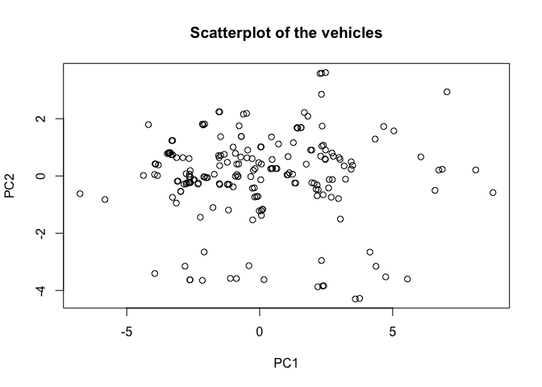
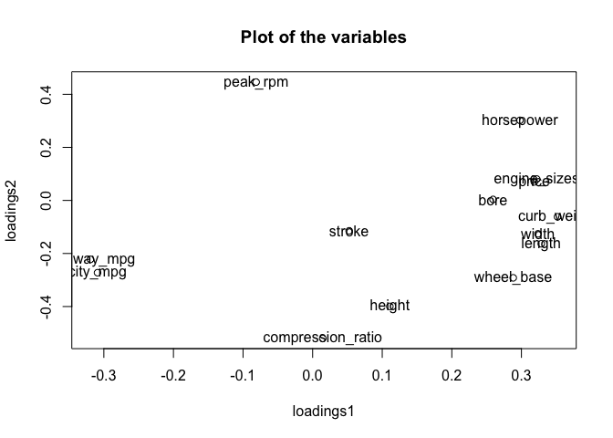
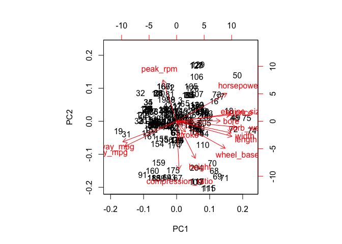

hw01-Keqin-Cao
================
Keqin
February 23, 2018

``` r
#2. Data Import
library(readr)
###Use read.csv()
rename_col <- c(
    'symboling', 
    'normalized_losses', 
    'make',
    'fuel_type',
    'aspiration',
    'num_of_doors',
    'body_style',
    'drive_wheels',
    'engine_location',
    'wheel_base',
    'length',
    'width',
    'height',
    'curb_weight',
    'engine_type',
    'num_of_cylinders',
    'engine_sizes',
    'fuel_system',
    'bore',
    'stroke',
    'compression_ratio',
    'horsepower',
    'peak_rpm',
    'city_mpg',
    'highway_mpg',
    'price'
)

column_types <- c(
    'double',
    'double',
    rep('character', 7),
    rep('double', 4),
    'integer',
    'character',
    'character',
    'integer',
    'character',
    'double',
    'double',
    'double',
    rep('integer',5)
)

info_base <- read.csv("imports-85.data",col.names = rename_col, colClasses = column_types, na.strings = "?", header = F)
str(info_base)
```

    ## 'data.frame':    205 obs. of  26 variables:
    ##  $ symboling        : num  3 3 1 2 2 2 1 1 1 0 ...
    ##  $ normalized_losses: num  NA NA NA 164 164 NA 158 NA 158 NA ...
    ##  $ make             : chr  "alfa-romero" "alfa-romero" "alfa-romero" "audi" ...
    ##  $ fuel_type        : chr  "gas" "gas" "gas" "gas" ...
    ##  $ aspiration       : chr  "std" "std" "std" "std" ...
    ##  $ num_of_doors     : chr  "two" "two" "two" "four" ...
    ##  $ body_style       : chr  "convertible" "convertible" "hatchback" "sedan" ...
    ##  $ drive_wheels     : chr  "rwd" "rwd" "rwd" "fwd" ...
    ##  $ engine_location  : chr  "front" "front" "front" "front" ...
    ##  $ wheel_base       : num  88.6 88.6 94.5 99.8 99.4 ...
    ##  $ length           : num  169 169 171 177 177 ...
    ##  $ width            : num  64.1 64.1 65.5 66.2 66.4 66.3 71.4 71.4 71.4 67.9 ...
    ##  $ height           : num  48.8 48.8 52.4 54.3 54.3 53.1 55.7 55.7 55.9 52 ...
    ##  $ curb_weight      : int  2548 2548 2823 2337 2824 2507 2844 2954 3086 3053 ...
    ##  $ engine_type      : chr  "dohc" "dohc" "ohcv" "ohc" ...
    ##  $ num_of_cylinders : chr  "four" "four" "six" "four" ...
    ##  $ engine_sizes     : int  130 130 152 109 136 136 136 136 131 131 ...
    ##  $ fuel_system      : chr  "mpfi" "mpfi" "mpfi" "mpfi" ...
    ##  $ bore             : num  3.47 3.47 2.68 3.19 3.19 3.19 3.19 3.19 3.13 3.13 ...
    ##  $ stroke           : num  2.68 2.68 3.47 3.4 3.4 3.4 3.4 3.4 3.4 3.4 ...
    ##  $ compression_ratio: num  9 9 9 10 8 8.5 8.5 8.5 8.3 7 ...
    ##  $ horsepower       : int  111 111 154 102 115 110 110 110 140 160 ...
    ##  $ peak_rpm         : int  5000 5000 5000 5500 5500 5500 5500 5500 5500 5500 ...
    ##  $ city_mpg         : int  21 21 19 24 18 19 19 19 17 16 ...
    ##  $ highway_mpg      : int  27 27 26 30 22 25 25 25 20 22 ...
    ##  $ price            : int  13495 16500 16500 13950 17450 15250 17710 18920 23875 NA ...

``` r
###use read_csv
info_readr <- read_csv("imports-85.data",col_names = rename_col, col_types = list(
  "symboling" = col_double(),
  "normalized_losses" = col_double(),
  "bore" = col_double(),
  "stroke"= col_double(),
  "horsepower"=col_integer(),
  "peak_rpm"=col_integer(),
  "price"=col_integer()
))
```

    ## Warning in rbind(names(probs), probs_f): number of columns of result is not
    ## a multiple of vector length (arg 1)

    ## Warning: 57 parsing failures.
    ## row # A tibble: 5 x 5 col     row col               expected actual file              expected   <int> <chr>             <chr>    <chr>  <chr>             actual 1     1 normalized_losses a double ?      'imports-85.data' file 2     2 normalized_losses a double ?      'imports-85.data' row 3     3 normalized_losses a double ?      'imports-85.data' col 4     6 normalized_losses a double ?      'imports-85.data' expected 5     8 normalized_losses a double ?      'imports-85.data'
    ## ... ................. ... ........................................................... ........ ........................................................... ...... ........................................................... .... ........................................................... ... ........................................................... ... ........................................................... ........ ...........................................................
    ## See problems(...) for more details.

``` r
str(info_readr)      
```

    ## Classes 'tbl_df', 'tbl' and 'data.frame':    205 obs. of  26 variables:
    ##  $ symboling        : num  3 3 1 2 2 2 1 1 1 0 ...
    ##  $ normalized_losses: num  NA NA NA 164 164 NA 158 NA 158 NA ...
    ##  $ make             : chr  "alfa-romero" "alfa-romero" "alfa-romero" "audi" ...
    ##  $ fuel_type        : chr  "gas" "gas" "gas" "gas" ...
    ##  $ aspiration       : chr  "std" "std" "std" "std" ...
    ##  $ num_of_doors     : chr  "two" "two" "two" "four" ...
    ##  $ body_style       : chr  "convertible" "convertible" "hatchback" "sedan" ...
    ##  $ drive_wheels     : chr  "rwd" "rwd" "rwd" "fwd" ...
    ##  $ engine_location  : chr  "front" "front" "front" "front" ...
    ##  $ wheel_base       : num  88.6 88.6 94.5 99.8 99.4 ...
    ##  $ length           : num  169 169 171 177 177 ...
    ##  $ width            : num  64.1 64.1 65.5 66.2 66.4 66.3 71.4 71.4 71.4 67.9 ...
    ##  $ height           : num  48.8 48.8 52.4 54.3 54.3 53.1 55.7 55.7 55.9 52 ...
    ##  $ curb_weight      : int  2548 2548 2823 2337 2824 2507 2844 2954 3086 3053 ...
    ##  $ engine_type      : chr  "dohc" "dohc" "ohcv" "ohc" ...
    ##  $ num_of_cylinders : chr  "four" "four" "six" "four" ...
    ##  $ engine_sizes     : int  130 130 152 109 136 136 136 136 131 131 ...
    ##  $ fuel_system      : chr  "mpfi" "mpfi" "mpfi" "mpfi" ...
    ##  $ bore             : num  3.47 3.47 2.68 3.19 3.19 3.19 3.19 3.19 3.13 3.13 ...
    ##  $ stroke           : num  2.68 2.68 3.47 3.4 3.4 3.4 3.4 3.4 3.4 3.4 ...
    ##  $ compression_ratio: num  9 9 9 10 8 8.5 8.5 8.5 8.3 7 ...
    ##  $ horsepower       : int  111 111 154 102 115 110 110 110 140 160 ...
    ##  $ peak_rpm         : int  5000 5000 5000 5500 5500 5500 5500 5500 5500 5500 ...
    ##  $ city_mpg         : int  21 21 19 24 18 19 19 19 17 16 ...
    ##  $ highway_mpg      : int  27 27 26 30 22 25 25 25 20 22 ...
    ##  $ price            : int  13495 16500 16500 13950 17450 15250 17710 18920 23875 NA ...
    ##  - attr(*, "problems")=Classes 'tbl_df', 'tbl' and 'data.frame': 57 obs. of  5 variables:
    ##   ..$ row     : int  1 2 3 6 8 10 10 15 16 17 ...
    ##   ..$ col     : chr  "normalized_losses" "normalized_losses" "normalized_losses" "normalized_losses" ...
    ##   ..$ expected: chr  "a double" "a double" "a double" "a double" ...
    ##   ..$ actual  : chr  "?" "?" "?" "?" ...
    ##   ..$ file    : chr  "'imports-85.data'" "'imports-85.data'" "'imports-85.data'" "'imports-85.data'" ...
    ##  - attr(*, "spec")=List of 2
    ##   ..$ cols   :List of 26
    ##   .. ..$ symboling        : list()
    ##   .. .. ..- attr(*, "class")= chr  "collector_double" "collector"
    ##   .. ..$ normalized_losses: list()
    ##   .. .. ..- attr(*, "class")= chr  "collector_double" "collector"
    ##   .. ..$ make             : list()
    ##   .. .. ..- attr(*, "class")= chr  "collector_character" "collector"
    ##   .. ..$ fuel_type        : list()
    ##   .. .. ..- attr(*, "class")= chr  "collector_character" "collector"
    ##   .. ..$ aspiration       : list()
    ##   .. .. ..- attr(*, "class")= chr  "collector_character" "collector"
    ##   .. ..$ num_of_doors     : list()
    ##   .. .. ..- attr(*, "class")= chr  "collector_character" "collector"
    ##   .. ..$ body_style       : list()
    ##   .. .. ..- attr(*, "class")= chr  "collector_character" "collector"
    ##   .. ..$ drive_wheels     : list()
    ##   .. .. ..- attr(*, "class")= chr  "collector_character" "collector"
    ##   .. ..$ engine_location  : list()
    ##   .. .. ..- attr(*, "class")= chr  "collector_character" "collector"
    ##   .. ..$ wheel_base       : list()
    ##   .. .. ..- attr(*, "class")= chr  "collector_double" "collector"
    ##   .. ..$ length           : list()
    ##   .. .. ..- attr(*, "class")= chr  "collector_double" "collector"
    ##   .. ..$ width            : list()
    ##   .. .. ..- attr(*, "class")= chr  "collector_double" "collector"
    ##   .. ..$ height           : list()
    ##   .. .. ..- attr(*, "class")= chr  "collector_double" "collector"
    ##   .. ..$ curb_weight      : list()
    ##   .. .. ..- attr(*, "class")= chr  "collector_integer" "collector"
    ##   .. ..$ engine_type      : list()
    ##   .. .. ..- attr(*, "class")= chr  "collector_character" "collector"
    ##   .. ..$ num_of_cylinders : list()
    ##   .. .. ..- attr(*, "class")= chr  "collector_character" "collector"
    ##   .. ..$ engine_sizes     : list()
    ##   .. .. ..- attr(*, "class")= chr  "collector_integer" "collector"
    ##   .. ..$ fuel_system      : list()
    ##   .. .. ..- attr(*, "class")= chr  "collector_character" "collector"
    ##   .. ..$ bore             : list()
    ##   .. .. ..- attr(*, "class")= chr  "collector_double" "collector"
    ##   .. ..$ stroke           : list()
    ##   .. .. ..- attr(*, "class")= chr  "collector_double" "collector"
    ##   .. ..$ compression_ratio: list()
    ##   .. .. ..- attr(*, "class")= chr  "collector_double" "collector"
    ##   .. ..$ horsepower       : list()
    ##   .. .. ..- attr(*, "class")= chr  "collector_integer" "collector"
    ##   .. ..$ peak_rpm         : list()
    ##   .. .. ..- attr(*, "class")= chr  "collector_integer" "collector"
    ##   .. ..$ city_mpg         : list()
    ##   .. .. ..- attr(*, "class")= chr  "collector_integer" "collector"
    ##   .. ..$ highway_mpg      : list()
    ##   .. .. ..- attr(*, "class")= chr  "collector_integer" "collector"
    ##   .. ..$ price            : list()
    ##   .. .. ..- attr(*, "class")= chr  "collector_integer" "collector"
    ##   ..$ default: list()
    ##   .. ..- attr(*, "class")= chr  "collector_guess" "collector"
    ##   ..- attr(*, "class")= chr "col_spec"

3a. If you don’t provide a vector of column names, what happens to the column names of the imported data when you simply invoke read.csv('imports-85.data')? It's gonna treat the first row of the data as the column names and there will be no title and there will be one less obs. 3b. If you don’t provide a vector of column names, what happens to the column names of the imported data when you invoke read.csv('imports-85.data', header = FALSE)? It will automatically assign the name as V1,V2...Vn for you. There will be a header. 3c. When using the reading table functions, if you don’t specify how missing values are codified, what happens to the data type of those columns that contain '?', e.g. price or num\_of\_doors? If you don't specify how missing values are codified, for example: if you don't put na.string ="NA", the data type of the column is treated as string when there's '?' If we try to force that column into a numeric number, it will create error. 3d. Say you import imports-85.data in two different ways. In the first option you import the data without specifying the data type of each column. In the second option you do specify the data types. You may wonder whether both options return a data frame of the same memory size. You can actually use the function object.size() that provides an estimate of the memory that is being used to store an R object. Why is the data frame imported in the second option bigger (in terms of bytes) than the data frame imported in the second option? Because R is trying to optimize the data types in terms of memory efficiency.Because when we don't specify the data types, it will read the data as factors and after we specify the data types, it will read the data as string which takes more space than factors. Therefore, the data frame imported with specifying the data types will result in bigger in bytes. 3e. Say the object dat is the data frame produced when importing imports-85.data. What happens to the data values if you convert dat as an R matrix? All columns of a matrix needs to be of the same data type, where as data frame can support different types for different columns. That means if we convert this data to a matrix, all the data will be converted to one data type. If some columns have string which can not be numeric then the whole data is converted to strings. If all the columns are numeric then the matrix will retain the full data frame as numeric.In this problem, there are 26 columns in the data, so there're 26 attributes. The rows contain the values of its corresponding columns. We get a matrix of values.

``` r
###4 
###histogram of price with colored bars
hist(info_base$price, col = 'green')
```



``` r
#Description: Given that the histogram is a density plot. It does not follows the normal distribution and It's right skewed. The mean of the price is around 13207.13, The x axis is the price range and the y axis is the frequencies. 
summary(info_base$price, na.rm = TRUE)
```

    ##    Min. 1st Qu.  Median    Mean 3rd Qu.    Max.    NA's 
    ##    5118    7775   10295   13207   16500   45400       4

``` r
###boxplot of horsepower in horizontal orientation
boxplot(info_base$horsepower, horizontal = TRUE)
```



``` r
#Description: The mean of the boxplot is around 95. There a a couple outliers. It's relatively symmetrical with very slightly left skewed. 
###barplot of the frequencies of body_style, arranged in decreasing order.
data_for_barplot<- table(info_base$body_style)
count<- data_for_barplot[order(data_for_barplot, decreasing = TRUE)]
barplot( count, main= 'Body Style', xlab= "numbers of style" )
```



``` r
#Description: Sedan is the most body style and convertible is the least. From the plot, we can see the the #of body style in a decreasing order.  
###stars() plot of vehicles with turbo aspiration, using only variables wheel-base,length, width, height, and price.
library("dplyr")
```

    ## 
    ## Attaching package: 'dplyr'

    ## The following objects are masked from 'package:stats':
    ## 
    ##     filter, lag

    ## The following objects are masked from 'package:base':
    ## 
    ##     intersect, setdiff, setequal, union

``` r
Aspiration = select(info_base, aspiration, wheel_base, length, width, height, price)
Turbo_aspiration = filter(Aspiration, aspiration == "turbo")
df <- select(Turbo_aspiration, wheel_base, length, width, height, price)
stars(df, full = T, labels = 1:37,col.segments = c("red", "green","blue", "orange", "yellow"), draw.segments = TRUE)
```



``` r
##description: The star plot exams the relative values for a single observation. The length is proportional to the magnitude of the variable of the maximum length across the data sets. There are total 37 observations of cars with turbo aspiration. 
```

``` r
###5 a)What is the mean price of fuel_type gas cars? And what is the mean price offuel_type diesel cars? (removing missing values)
mean(info_readr$price[info_base$fuel_type == 'gas'], na.rm = TRUE)
```

    ## [1] 12916.41

``` r
mean(info_base$price[info_base$fuel_type == 'diesel'], na.rm = TRUE)
```

    ## [1] 15838.15

``` r
###5b). What is the make of the car with twelve num_of_cylinders?
info_base$make[info_base$num_of_cylinders == "twelve"]
```

    ## [1] "jaguar"

``` r
###5c. What is the make that has the most diesel cars?
b <-sort(table(info_base$make[info_base$fuel_type == 'diesel']), decreasing = FALSE)
tail(b, 1)
```

    ## peugot 
    ##      5

``` r
###5d. What is the price of the car with the largest amount of horsepower?
info_base$price[which.max(info_base$horsepower)]
```

    ## [1] NA

``` r
## The price of the car with the largest amount of horsepower is unknown.
###5e. What is the bottom 10th percentile of city_mpg?
quantile(info_base$city_mpg, .10,na.rm = TRUE) 
```

    ## 10% 
    ##  17

``` r
##5f  What is the top 10th percentile of highway_mpg?
quantile(info_base$highway_mpg, .90,na.rm = TRUE) 
```

    ## 90% 
    ##  38

``` r
###5g. What is the median price of those cars in the bottom 10th percentile of city_mpg?
median(info_base$price[info_base$city_mpg <= quantile(info_base$city_mpg, .10)], na.rm = TRUE)
```

    ## [1] 32250

``` r
###6a)What happens when you use the dollar $ operator on a data frame, attempting to use the name of a column that does not exist? For example: dat$xyz where there is no column named xyz.
###It will show up as NULL
###6b) b. Which of the following commands fails to return the vector mpg which is a column in the built-in data rfame mtcars:
###1. mtcars$mpg
###2. mtcars[ ,1]
###3. mtcars[[1]]
###4. mtcars[ ,mpg]               DOESN'T WORK
###5. mtcars[["mpg"]]
###6. mtcars$"mpg"
###7. mtcars[ ,"mpg"]
###6c) Because the data is trying to match with the string mpg so you must have quotes. If we don't reference with a quote, the compiler will try to resolve mpg as a variable first. There's no variable called mpg outside of mtcars, the program will refelct on error. 
###6d) No. Even though both data frames and lists are heterogenous forms of storing data and you can add the R list to the data frame as a new column, unless the length of list does not match the number of rows, you cannot force a single column into a data frame. The data type of elements in the list may be different. 
###6e) When we apply the as.list() to a data frame, it will convert the data into nested list format and it's no longer a 2 dimensional data frame. It will become like $mpg with all the number... $cyl with the all the data
###6f) You can use command as.data.frame() or data.frame() to convert abc to a dataframe as long as the structure meets the requirements of the data frame (e.g like they have equal length. )
```

``` r
###7
library(corrplot)
```

    ## corrplot 0.84 loaded

``` r
Quantitative = select(info_base, wheel_base, length, width, height, curb_weight, engine_sizes,bore,stroke, compression_ratio, horsepower, peak_rpm, city_mpg, highway_mpg,price)
qdat <- na.omit(Quantitative)
M <- cor(qdat)
head(round(M,2))
```

    ##              wheel_base length width height curb_weight engine_sizes bore
    ## wheel_base         1.00   0.88  0.82   0.59        0.78         0.57 0.50
    ## length             0.88   1.00  0.86   0.50        0.88         0.69 0.61
    ## width              0.82   0.86  1.00   0.32        0.87         0.74 0.54
    ## height             0.59   0.50  0.32   1.00        0.31         0.03 0.19
    ## curb_weight        0.78   0.88  0.87   0.31        1.00         0.86 0.65
    ## engine_sizes       0.57   0.69  0.74   0.03        0.86         1.00 0.58
    ##              stroke compression_ratio horsepower peak_rpm city_mpg
    ## wheel_base     0.17              0.25       0.38    -0.35    -0.50
    ## length         0.12              0.16       0.58    -0.28    -0.69
    ## width          0.19              0.19       0.62    -0.25    -0.65
    ## height        -0.06              0.26      -0.08    -0.26    -0.10
    ## curb_weight    0.17              0.16       0.76    -0.28    -0.77
    ## engine_sizes   0.21              0.02       0.84    -0.22    -0.71
    ##              highway_mpg price
    ## wheel_base         -0.57  0.59
    ## length             -0.72  0.70
    ## width              -0.69  0.75
    ## height             -0.15  0.14
    ## curb_weight        -0.81  0.84
    ## engine_sizes       -0.73  0.89

``` r
corrplot(M, method = "circle")
```



``` r
corrplot(M, method = "pie")
```



``` r
corrplot(M, method = "number")
```



``` r
##Description The first plot uses colors to indicate whether the correlation is strong, and the darker the color is shows the stronger the correlation between these two variables. The third plot uses number to indicate whether the correlation is strong, and the larger the number, the stronger the correlation between these two variables.
```

``` r
###8.1 Use prcomp() to perform a principal components analysis on qdat; use the argument scale. = TRUE to carry out PCA on standardized data.
pca_prcomp<- prcomp(qdat, scale. = TRUE)
###Examine the eigenvalues and determine the proportion of variation that is “captured” by the first three components.
eigenvalues <- pca_prcomp$sdev^2
eigenvalues
```

    ##  [1] 7.53181553 2.27923094 1.21613308 0.90961519 0.60894217 0.41570430
    ##  [7] 0.32059895 0.27014548 0.12030933 0.11060092 0.08158813 0.06422049
    ## [13] 0.05139667 0.01969881

``` r
eigs_perc <- 100 * eigenvalues/ sum(eigenvalues)


percentage <- 100* eigenvalues / sum(eigenvalues)
cumulative <- cumsum(percentage)
proportion <- data.frame(eigenvalues, percentage, cumulative)
print(round(proportion, 4), print.gap = 2)
```

    ##     eigenvalues  percentage  cumulative
    ## 1        7.5318     53.7987     53.7987
    ## 2        2.2792     16.2802     70.0789
    ## 3        1.2161      8.6867     78.7656
    ## 4        0.9096      6.4973     85.2628
    ## 5        0.6089      4.3496     89.6124
    ## 6        0.4157      2.9693     92.5817
    ## 7        0.3206      2.2900     94.8717
    ## 8        0.2701      1.9296     96.8013
    ## 9        0.1203      0.8594     97.6607
    ## 10       0.1106      0.7900     98.4507
    ## 11       0.0816      0.5828     99.0335
    ## 12       0.0642      0.4587     99.4922
    ## 13       0.0514      0.3671     99.8593
    ## 14       0.0197      0.1407    100.0000

``` r
###The first 3 is 53.8% variability (Percentage)is captured by PC1, 16.2% by PC2, and 8.7% by PC3 and the cumulative is 55.5122, 70.2288, and 79.6572.

###8.2
###Use the first two components to graph a scatterplot of the vehicles (do not use "ggplot2" functions)
components <- as.data.frame(pca_prcomp["x"])
components2 <- components[,1:2]
plot(components2,xlab= "PC1", ylab="PC2", main="Scatterplot of the vehicles")
```



``` r
###Use the first two loadings (i.e. eigenvectors) to graph the variables.
loadings <- pca_prcomp$rotation
loadings2 <- as.data.frame(loadings)[,1:2]
plot(loadings2,xlab="loadings1", ylab = "loadings2", main = 'Plot of the variables')
text(loadings2[,1], loadings2[,2], labels = rownames(loadings2))
```



``` r
###Optionally, you can call biplot() of the "prcomop" object to get a simultaneous plot of both the vehicles and the variables.
biplot(pca_prcomp)
```



``` r
###Description: Plot one allows us to visualize the resemblance of indivudual data and how variables are correlated. Each plot is a single observations. We can see that there's some correlations between the cars ,but it seems very random and we need to do more to explore the deepen relationships.
###From the plot 2 we can see that the city_mpg and highway_mpg contributes to the most PC1 because they have the largest variation. Peak_rpm and compression_ratio contributes the most to PC2 because they are at the edge and they have the largest variation. Plot 2 is more direct for us to intrepret.
###The plot 3 is a biplot which more directly shows the relationship and correlation. The red arrow is how far away that the data pulls from the center. The further it is, the stronger influence it has on the PCA coordinates.
```
