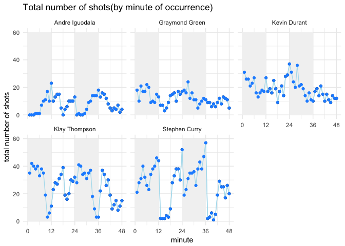

hw02-Keqin-Cao
================

``` r
setwd('/Users/sunsgne/Desktop/Stat133/hw-stat133/hw02')

library('knitr')
library('readr')
library("dplyr")
```

    ## 
    ## Attaching package: 'dplyr'

    ## The following objects are masked from 'package:stats':
    ## 
    ##     filter, lag

    ## The following objects are masked from 'package:base':
    ## 
    ##     intersect, setdiff, setequal, union

``` r
library("ggplot2")
library('devtools')
library('magicfor')
library('grid')
library('jpeg')
library("gridExtra")
```

    ## 
    ## Attaching package: 'gridExtra'

    ## The following object is masked from 'package:dplyr':
    ## 
    ##     combine

``` r
dat<- read.csv('data/shots-data.csv',stringsAsFactors = FALSE, na.strings = "?")
```

``` r
#5.1Total number of shots (2PT and 3PT, both made and missed) by player, arranged in descending order. This tibble should have the format depicted in the diagram below.
total_shots <- arrange(summarise(group_by(dat,name),totalshots=length(shot_type)),desc(totalshots))
total_shots
```

    ## # A tibble: 5 x 2
    ##   name           totalshots
    ##   <chr>               <int>
    ## 1 Stephen Curry        1250
    ## 2 Klay Thompson        1220
    ## 3 Kevin Durant          915
    ## 4 Draymond Green        578
    ## 5 Andre Iguodala        371

``` r
#5.2
###Effective shooting % by player
effect_dat23 <- filter(dat, shot_made_flag == "made shot")
total_shots23 <- summarise(group_by(dat,name),totalshots=length(shot_type))
made_shot23 <- summarise(group_by(effect_dat23,name),made=length(shot_made_flag))$made
effective_shots <- arrange(mutate(total_shots23,made=made_shot23,perc_made = made/totalshots),desc(perc_made))
effective_shots
```

    ## # A tibble: 5 x 4
    ##   name           totalshots  made perc_made
    ##   <chr>               <int> <int>     <dbl>
    ## 1 Kevin Durant          915   495     0.541
    ## 2 Andre Iguodala        371   192     0.518
    ## 3 Klay Thompson        1220   575     0.471
    ## 4 Stephen Curry        1250   584     0.467
    ## 5 Draymond Green        578   245     0.424

``` r
###2PT Effective Shooting% by Player2
pt2<- filter(effect_dat23, shot_type == '2PT Field Goal')
made2<- summarise(group_by(pt2,name),made=length(shot_made_flag))$made
effective_shots2<- arrange(mutate(total_shots23,made=made2,perc_made=made/totalshots),desc(perc_made))
effective_shots2
```

    ## # A tibble: 5 x 4
    ##   name           totalshots  made perc_made
    ##   <chr>               <int> <int>     <dbl>
    ## 1 Kevin Durant          915   390     0.426
    ## 2 Andre Iguodala        371   134     0.361
    ## 3 Draymond Green        578   171     0.296
    ## 4 Klay Thompson        1220   329     0.270
    ## 5 Stephen Curry        1250   304     0.243

``` r
###3PT Effective 
pt3<- filter(effect_dat23, shot_type == '3PT Field Goal')
made3<- summarise(group_by(pt3,name),made=length(shot_made_flag))$made
effective_shots3<- arrange(mutate(total_shots23,made=made3,perc_made=made3/totalshots),desc(perc_made))
effective_shots3
```

    ## # A tibble: 5 x 4
    ##   name           totalshots  made perc_made
    ##   <chr>               <int> <int>     <dbl>
    ## 1 Stephen Curry        1250   280     0.224
    ## 2 Klay Thompson        1220   246     0.202
    ## 3 Andre Iguodala        371    58     0.156
    ## 4 Draymond Green        578    74     0.128
    ## 5 Kevin Durant          915   105     0.115

``` r
#6.1 More precisely, use dplyr operations to obtain a tibble with two columns: shot_distance and made_shot_prop. The first row of the tibble should contain the value of distance = 0 ft, and the associated proportion of made shots (of all the five analyzed players). The second row should contain the value of distance = 1 ft, and the corresponding proportion of made shots; and so on

shotprop<- dat %>%       
  group_by(shot_distance)%>%summarise(
    made_shot_prop = sum(shot_made_flag=="made shot")/length(shot_made_flag)
  )
shotprop
```

    ## # A tibble: 56 x 2
    ##    shot_distance made_shot_prop
    ##            <int>          <dbl>
    ##  1             0          0.841
    ##  2             1          0.668
    ##  3             2          0.534
    ##  4             3          0.373
    ##  5             4          0.411
    ##  6             5          0.286
    ##  7             6          0.396
    ##  8             7          0.395
    ##  9             8          0.463
    ## 10             9          0.321
    ## # ... with 46 more rows

``` r
#6.2
pdistanceplot<- ggplot(shotprop)+geom_point(aes(x= shot_distance, y= made_shot_prop, color = shot_distance))+ ggtitle('Distance Prop')+xlab("shot distance distance")+ylab("made shot propoertion")
```

### What do you observe?

Firstly, when we make the graph, there are 16 rows of data is removed. It's because that in the dataset, some distance has no attempts of shotting. Therefore, it's removed. Then we can see at distance 0 it has the highest proportion of shotting made.Parts of the reasons are that those are the easiest one for NBA players because most of them can dunk. When distance is larger than 35 feet, it's almost impossible to shot made. There's only one exception but we can see that it's too hard for anyone to shot in from such far distance. That exception is mostly due to luck. The distance 1,2,3 has the highest shotting made and from 5 to 20 it's positive correlated and from 20 to 30 it's slightly negative correlated. This is due to the difference in 2pts and 3pts shotting position. There are certain spots is "too close"(a bad angle) for 2 pts.

### Can you confirm that the shorter the distance, the more effective the shots?

Yes. In general, we can see that the proportion for shotting made at 0,1,and 2 feets are 0.8410758, 0.668, 0.5335 which are all above 50%. After distance&gt;3, the prop is not as close as 50% and after distance 40 there's almost 0 shots, so we can conclude that the shorter the distance, the more effective the shots.

### Can you guesstimate a distance threshold beyond which the chance of making a successful shot is basically null?

When the distance &gt;35 feets

### What distances tend to have a percentage (of making a shot) of 50% or more?

Distance 0,1,and 2 feets.

``` r
#7.Create a facetted graph of the total number of shots by minute of occurrence, depicting a facet per player, similar to the plot below. 
###Curry
curry<- filter(dat, name=="Stephen Curry")
magic_for(silent = TRUE)
for (i in seq(1,48,by=1)){
     currytotal<- print(sum(curry$minute==i))
     put(currytotal)
}
```

    ## [1] 21
    ## [1] 28
    ## [1] 31
    ## [1] 40
    ## [1] 32
    ## [1] 26
    ## [1] 23
    ## [1] 34
    ## [1] 38
    ## [1] 40
    ## [1] 46
    ## [1] 44
    ## [1] 2
    ## [1] 2
    ## [1] 2
    ## [1] 4
    ## [1] 3
    ## [1] 9
    ## [1] 28
    ## [1] 33
    ## [1] 38
    ## [1] 38
    ## [1] 30
    ## [1] 52
    ## [1] 19
    ## [1] 23
    ## [1] 31
    ## [1] 35
    ## [1] 35
    ## [1] 36
    ## [1] 26
    ## [1] 38
    ## [1] 43
    ## [1] 38
    ## [1] 47
    ## [1] 57
    ## [1] 2
    ## [1] 3
    ## [1] 6
    ## [1] 1
    ## [1] 5
    ## [1] 19
    ## [1] 29
    ## [1] 25
    ## [1] 25
    ## [1] 17
    ## [1] 26
    ## [1] 20

``` r
currytotalv <-  magic_result_as_dataframe()

#Thompson
thompson<- filter(dat, name=="Klay Thompson")
magic_for(silent = TRUE)
for (i in seq(1,48,by=1)){
     thompsontotal<- print(sum(thompson$minute==i))
     put(thompsontotal)
}
```

    ## [1] 35
    ## [1] 42
    ## [1] 40
    ## [1] 38
    ## [1] 40
    ## [1] 33
    ## [1] 38
    ## [1] 35
    ## [1] 19
    ## [1] 3
    ## [1] 6
    ## [1] 11
    ## [1] 23
    ## [1] 28
    ## [1] 27
    ## [1] 31
    ## [1] 34
    ## [1] 39
    ## [1] 19
    ## [1] 16
    ## [1] 20
    ## [1] 30
    ## [1] 29
    ## [1] 32
    ## [1] 28
    ## [1] 41
    ## [1] 40
    ## [1] 34
    ## [1] 35
    ## [1] 31
    ## [1] 35
    ## [1] 37
    ## [1] 18
    ## [1] 9
    ## [1] 3
    ## [1] 3
    ## [1] 22
    ## [1] 37
    ## [1] 34
    ## [1] 26
    ## [1] 30
    ## [1] 19
    ## [1] 9
    ## [1] 12
    ## [1] 15
    ## [1] 8
    ## [1] 11
    ## [1] 15

``` r
thompsontotalv <-  magic_result_as_dataframe()

#andre
andre<- filter(dat, name=="Andre Iguodala")
magic_for(silent = TRUE)
for (i in seq(1,48,by=1)){
     andretotal<- print(sum(andre$minute==i))
     put(andretotal)
}
```

    ## [1] 0
    ## [1] 0
    ## [1] 0
    ## [1] 1
    ## [1] 1
    ## [1] 1
    ## [1] 7
    ## [1] 10
    ## [1] 11
    ## [1] 17
    ## [1] 10
    ## [1] 23
    ## [1] 10
    ## [1] 13
    ## [1] 15
    ## [1] 15
    ## [1] 5
    ## [1] 0
    ## [1] 4
    ## [1] 6
    ## [1] 10
    ## [1] 10
    ## [1] 10
    ## [1] 13
    ## [1] 0
    ## [1] 1
    ## [1] 0
    ## [1] 0
    ## [1] 1
    ## [1] 4
    ## [1] 9
    ## [1] 10
    ## [1] 14
    ## [1] 14
    ## [1] 14
    ## [1] 18
    ## [1] 13
    ## [1] 16
    ## [1] 15
    ## [1] 12
    ## [1] 8
    ## [1] 5
    ## [1] 3
    ## [1] 5
    ## [1] 4
    ## [1] 7
    ## [1] 2
    ## [1] 4

``` r
andretotalv <-  magic_result_as_dataframe()

###durant
durant<- filter(dat, name=="Kevin Durant")
magic_for(silent = TRUE)
for (i in seq(1,48,by=1)){
     duranttotal<- print(sum(durant$minute==i))
     put(duranttotal)
}
```

    ## [1] 31
    ## [1] 26
    ## [1] 26
    ## [1] 21
    ## [1] 23
    ## [1] 27
    ## [1] 16
    ## [1] 13
    ## [1] 16
    ## [1] 18
    ## [1] 17
    ## [1] 27
    ## [1] 17
    ## [1] 19
    ## [1] 16
    ## [1] 25
    ## [1] 19
    ## [1] 9
    ## [1] 17
    ## [1] 21
    ## [1] 14
    ## [1] 28
    ## [1] 29
    ## [1] 37
    ## [1] 31
    ## [1] 24
    ## [1] 20
    ## [1] 36
    ## [1] 21
    ## [1] 22
    ## [1] 19
    ## [1] 14
    ## [1] 10
    ## [1] 16
    ## [1] 11
    ## [1] 10
    ## [1] 17
    ## [1] 19
    ## [1] 14
    ## [1] 21
    ## [1] 15
    ## [1] 10
    ## [1] 15
    ## [1] 11
    ## [1] 9
    ## [1] 14
    ## [1] 12
    ## [1] 12

``` r
duranttotalv <-  magic_result_as_dataframe()

###green
green<- filter(dat, name=="Draymond Green")
magic_for(silent = TRUE)
for (i in seq(1,48,by=1)){
     greentotal<- print(sum(green$minute==i))
     put(greentotal)
}
```

    ## [1] 18
    ## [1] 10
    ## [1] 21
    ## [1] 17
    ## [1] 17
    ## [1] 22
    ## [1] 20
    ## [1] 9
    ## [1] 10
    ## [1] 9
    ## [1] 15
    ## [1] 13
    ## [1] 7
    ## [1] 7
    ## [1] 3
    ## [1] 5
    ## [1] 9
    ## [1] 14
    ## [1] 15
    ## [1] 16
    ## [1] 10
    ## [1] 17
    ## [1] 15
    ## [1] 17
    ## [1] 18
    ## [1] 16
    ## [1] 24
    ## [1] 12
    ## [1] 16
    ## [1] 11
    ## [1] 11
    ## [1] 5
    ## [1] 8
    ## [1] 10
    ## [1] 12
    ## [1] 11
    ## [1] 9
    ## [1] 9
    ## [1] 6
    ## [1] 8
    ## [1] 6
    ## [1] 9
    ## [1] 12
    ## [1] 8
    ## [1] 13
    ## [1] 12
    ## [1] 11
    ## [1] 5

``` r
greentotalv <-  magic_result_as_dataframe()

cgreen <- cbind(total = greentotalv, name = "Graymond Green")[,-1]
names(cgreen)[1] <- "total"
ccurry <- cbind(total = currytotalv, name = "Stephen Curry")[,-1]
names(ccurry)[1] <- "total"
cthompson <- cbind(total = thompsontotalv, name = "Klay Thompson")[,-1]
names(cthompson)[1] <- "total"
cdurant <- cbind(total = duranttotalv, name = "Kevin Durant")[,-1]
names(cdurant)[1] <- "total"
candre <- cbind(total = andretotalv, name = "Andre Iguodala")[,-1]
names(candre)[1] <- "total"
combineplots <-rbind(candre,cgreen,cdurant,cthompson,ccurry)
combineplots$order<-seq(1,48,by=1)

combineplot<-ggplot(combineplots)+facet_wrap(~name)+geom_point(aes(x=order,y=combineplots$total))+geom_path(color='lightblue2',mapping=aes(x=order,y=combineplots$total),size=0.5)+scale_x_continuous(limits = c(0,48), breaks = seq(0,48, by=12))+geom_rect(fill="grey95", mapping = aes(xmin=0, xmax=12, ymin=0, ymax=60), alpha=1)+geom_rect(fill="grey95", mapping = aes(xmin=24, xmax=36, ymin=0, ymax=60),alpha=1)+geom_path(color='lightblue2',mapping=aes(x=order,y=combineplots$total),size=0.5)+theme_minimal()+xlab("minute") + ylab("total number of shots")+ggtitle('Total number of shots(by minute of occurrence)')+geom_point(aes(x=order,y=combineplots$total),color="dodgerblue")
combineplot
```



``` r
print(combineplot)
```


