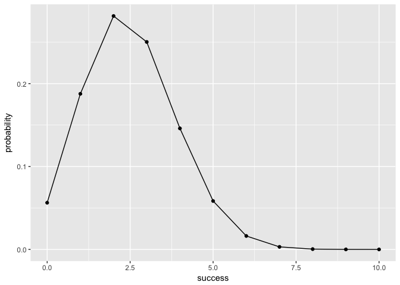

hw03-keqin-cao
================
Keqin Cao
3/11/2018

``` bash
#2.1  Write a pipeline to obtain the unique team names, and redirect the output to a text fileteam-names.txt. Use head to display the first five lines of the created file (output shownbelown).
cut -d "," -f 2 nba2017-roster.csv | sort -u  > team-names.txt
head -n 5 team-names.txt 
```

    ## "ATL"
    ## "BOS"
    ## "BRK"
    ## "CHI"
    ## "CHO"

``` bash
#2.2 Write a pipeline to obtain the unique positions, and redirect the output to a text fileposition-names.txt. Use head to display the first five lines of the created file (outputshown belown)
cut -d "," -f 3 nba2017-roster.csv | sort -u  >position-names.txt
head -n 5 position-names.txt 
```

    ## "C"
    ## "PF"
    ## "PG"
    ## "SF"
    ## "SG"

``` bash
 
#Write a pipeline to obtain the counts (i.e. frequencies) of the different experience values,displayed from largest to smallest (i.e. descending order). Redirect the output to a text file experience-counts.txt. Use head to display the first five lines of the created file (output4 shown belown). The first column corresponds to count, the second column corresponds to experience
cut -d "," -f 7  nba2017-roster.csv|sort|uniq -c|sort -nk1|sort -r> experience-counts.txt
head -5 experience-counts.txt
```

    ##   80 0
    ##   52 1
    ##   46 2
    ##   36 3
    ##   35 4

``` bash
#Use output redirection commands to create a CSV file LAC.csv containing data for the LAC team (Los Angeles Clippers). Your CSV file should include column names. Use cat to display the content of the created file (output shown belown).
grep "position\|LAC"  nba2017-roster.csv > LAC.csv
cat LAC.csv
```

    ## "player","team","position","height","weight","age","experience","salary"
    ## "Alan Anderson","LAC","SF",78,220,34,7,1315448
    ## "Austin Rivers","LAC","SG",76,200,24,4,1.1e+07
    ## "Blake Griffin","LAC","PF",82,251,27,6,20140838
    ## "Brandon Bass","LAC","PF",80,250,31,11,1551659
    ## "Brice Johnson","LAC","PF",82,230,22,0,1273920
    ## "Chris Paul","LAC","PG",72,175,31,11,22868828
    ## "DeAndre Jordan","LAC","C",83,265,28,8,21165675
    ## "Diamond Stone","LAC","C",83,255,19,0,543471
    ## "J.J. Redick","LAC","SG",76,190,32,10,7377500
    ## "Jamal Crawford","LAC","SG",77,200,36,16,13253012
    ## "Luc Mbah a Moute","LAC","SF",80,230,30,8,2203000
    ## "Marreese Speights","LAC","C",82,255,29,8,1403611
    ## "Paul Pierce","LAC","SF",79,235,39,18,3500000
    ## "Raymond Felton","LAC","PG",73,205,32,11,1551659
    ## "Wesley Johnson","LAC","SF",79,215,29,6,5628000

``` bash
# Write a pipeline to display the age frequencies of LAL players. The first columncorresponds to count, the second column corresponds to age.
grep "LAL" nba2017-roster.csv| cut -d "," -f 6|sort| uniq -c
```

    ##    2 19
    ##    1 20
    ##    2 22
    ##    3 24
    ##    2 25
    ##    2 30
    ##    2 31
    ##    1 37

``` bash
#Write a pipeline to find the number of players in CLE (Cleveland) team; the output should be just the number of players.
grep "CLE" nba2017-roster.csv|wc -l
```

    ##       15

``` bash
#2.7) Write pipelines to create a CSV file gsw-height-weight.csv that contains the player,height and weight of GSW players. Your CSV file should include column names. Use cat to display the file contents:
grep "GSW\|player" nba2017-roster.csv|cut -d, -f 1,4,5 > gsw-height-weight.csv
cat gsw-height-weight.csv
```

    ## "player","height","weight"
    ## "Andre Iguodala",78,215
    ## "Damian Jones",84,245
    ## "David West",81,250
    ## "Draymond Green",79,230
    ## "Ian Clark",75,175
    ## "James Michael McAdoo",81,230
    ## "JaVale McGee",84,270
    ## "Kevin Durant",81,240
    ## "Kevon Looney",81,220
    ## "Klay Thompson",79,215
    ## "Matt Barnes",79,226
    ## "Patrick McCaw",79,185
    ## "Shaun Livingston",79,192
    ## "Stephen Curry",75,190
    ## "Zaza Pachulia",83,270

``` bash
#Write pipelines to create a file top10-salaries.csv containing the top10 player salaries,arranged by salary from largest to smallest. Your CSV file should include column names.Use cat to display the file contents:
cut -d "," -f 1,8 nba2017-roster.csv|sort -t"," -k 2 -n -r| head -10>1.csv
grep "player\|salary" nba2017-roster.csv | cut -d "," -f 1,8 >2.csv
cat 2.csv 1.csv >top10-salaries.csv
cat top10-salaries.csv
rm 1.csv
rm 2.csv
```

    ## "player","salary"
    ## "LeBron James",30963450
    ## "Russell Westbrook",26540100
    ## "Mike Conley",26540100
    ## "Kevin Durant",26540100
    ## "James Harden",26540100
    ## "DeMar DeRozan",26540100
    ## "Al Horford",26540100
    ## "Carmelo Anthony",24559380
    ## "Damian Lillard",24328425
    ## "Dwyane Wade",23200000

``` r
library(knitr)
source('code/binomial-functions.R')
#Assume that the “successful” event is getting a “six” when rolling a die. Consider rolling a fair die 10 times. Use bin_probability() to find the probability of getting exactly 3 sixes.
bin_probability(10,3,1/6)
```

    ## [1] 0.1550454

``` r
# Use bin_distribution() to obtain the distribution of the number of “sixes” when rolling a loaded die 10 times, in which the number “six” has probability of 0.25. Make a plot of this distribution.
six<- bin_distribution(10, 0.25)
six
```

    ##    success  probability
    ## 1        0 5.631351e-02
    ## 2        1 1.877117e-01
    ## 3        2 2.815676e-01
    ## 4        3 2.502823e-01
    ## 5        4 1.459980e-01
    ## 6        5 5.839920e-02
    ## 7        6 1.622200e-02
    ## 8        7 3.089905e-03
    ## 9        8 3.862381e-04
    ## 10       9 2.861023e-05
    ## 11      10 9.536743e-07

``` r
ggplot(six)+geom_line(aes(x= success, y=probability))+geom_point(aes(x= success, y=probability))
```



``` r
# Use bin_probability(), and a for loop, to obtain the probability of getting more than 3 heads in 5 tosses with a biased coin of 35% chance of heads.
probability = 0
for (i in 4:5) {
  probability = bin_probability(5,i, 0.35) + probability
} 
probability
```

    ## [1] 0.0540225

``` r
# Use bin_distribution() to obtain the probability distribution of the number of heads when tossing a loaded coin 15 times, with 35% chance of heads. Make a plot of this distribution.
loadedcoin<-bin_distribution(15, 0.35)
loadedcoin
```

    ##    success  probability
    ## 1        0 1.562069e-03
    ## 2        1 1.261672e-02
    ## 3        2 4.755531e-02
    ## 4        3 1.109624e-01
    ## 5        4 1.792469e-01
    ## 6        5 2.123387e-01
    ## 7        6 1.905604e-01
    ## 8        7 1.319264e-01
    ## 9        8 7.103729e-02
    ## 10       9 2.975066e-02
    ## 11      10 9.611752e-03
    ## 12      11 2.352527e-03
    ## 13      12 4.222484e-04
    ## 14      13 5.246873e-05
    ## 15      14 4.036056e-06
    ## 16      15 1.448841e-07

``` r
ggplot(loadedcoin)+geom_line(aes(x= success, y=probability))+geom_point(aes(x= success, y=probability))
```


