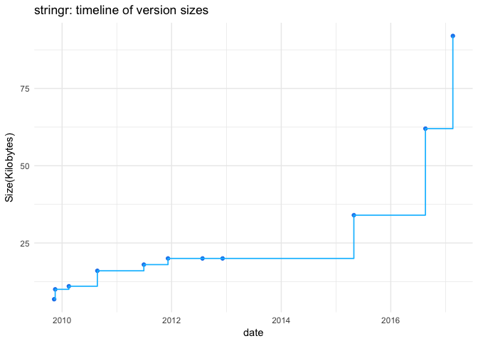
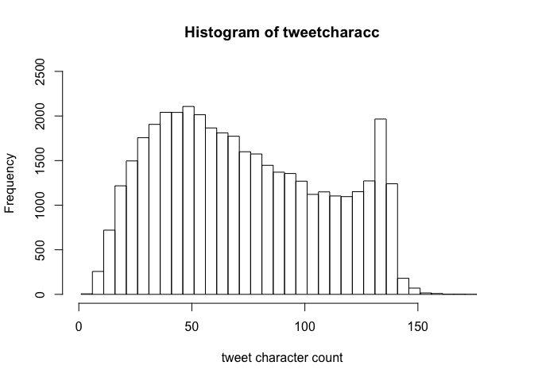
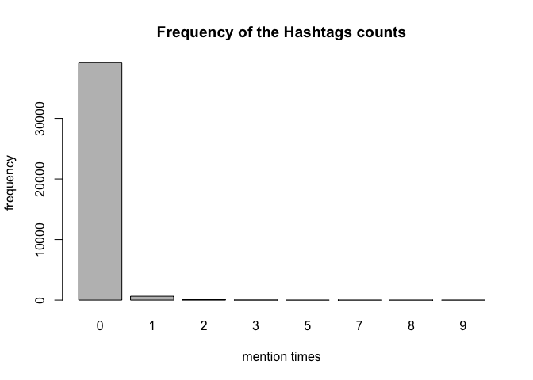
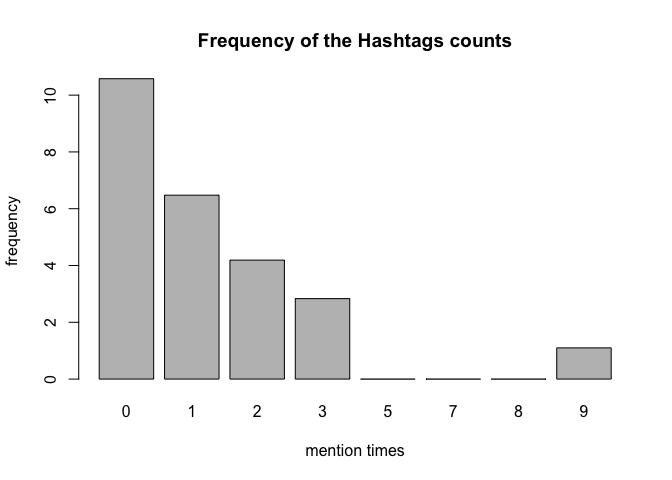

hw04-keqin-cao
================
Keqin Cao
4/3/2018

``` r
library("XML")
library("stringr")
library("ggplot2")
source("../code/archive-functions.R")
source("../code/regex-functions.R")
```

    ## Loading required package: Hmisc

    ## Loading required package: lattice

    ## Loading required package: survival

    ## Loading required package: Formula

    ## 
    ## Attaching package: 'Hmisc'

    ## The following objects are masked from 'package:base':
    ## 
    ##     format.pval, units

``` r
#1.4 Archive of "stringr"
raw_data <- read_archive('stringr')
print(raw_data)
```

    ## $`NULL`
    ##                      Name    Last modified Size Description
    ## 1                    <NA>             <NA> <NA>        <NA>
    ## 2        Parent Directory                     -            
    ## 3   stringr_0.1.10.tar.gz 2009-11-09 16:57 6.8K            
    ## 4      stringr_0.2.tar.gz 2009-11-16 20:25  10K            
    ## 5      stringr_0.3.tar.gz 2010-02-15 18:06  11K            
    ## 6      stringr_0.4.tar.gz 2010-08-24 16:33  16K            
    ## 7      stringr_0.5.tar.gz 2011-06-30 19:12  18K            
    ## 8    stringr_0.6.1.tar.gz 2012-07-25 21:59  20K            
    ## 9    stringr_0.6.2.tar.gz 2012-12-06 08:40  20K            
    ## 10     stringr_0.6.tar.gz 2011-12-08 20:02  20K            
    ## 11   stringr_1.0.0.tar.gz 2015-04-30 11:48  34K            
    ## 12   stringr_1.1.0.tar.gz 2016-08-19 21:02  62K            
    ## 13   stringr_1.2.0.tar.gz 2017-02-18 21:23  92K            
    ## 14                   <NA>             <NA> <NA>        <NA>

``` r
clean_data <- clean_archive(raw_data)
print(clean_data)
```

    ##       name version       date size
    ## 1  stringr  0.1.10 2009-11-09  6.8
    ## 2  stringr     0.2 2009-11-16 10.0
    ## 3  stringr     0.3 2010-02-15 11.0
    ## 4  stringr     0.4 2010-08-24 16.0
    ## 5  stringr     0.5 2011-06-30 18.0
    ## 6  stringr   0.6.1 2012-07-25 20.0
    ## 7  stringr   0.6.2 2012-12-06 20.0
    ## 8  stringr     0.6 2011-12-08 20.0
    ## 9  stringr   1.0.0 2015-04-30 34.0
    ## 10 stringr   1.1.0 2016-08-19 62.0
    ## 11 stringr   1.2.0 2017-02-18 92.0

``` r
print(plot_archive(clean_data))
```



``` r
#export csv file
raw_data <- read_archive('stringr')
clean_data<- clean_archive(raw_data)
write.csv(clean_data, file = "../data/stringr-archive.csv")
```

``` r
#Verifying the type of the data:
class(clean_data$name)
```

    ## [1] "character"

``` r
class(clean_data$version)
```

    ## [1] "character"

``` r
class(clean_data$date)
```

    ## [1] "Date"

``` r
class(clean_data$size)
```

    ## [1] "numeric"

``` r
#1.5)
raw_dataggplot <- read_archive('ggplot2')
clean_dataggplot<- clean_archive(raw_dataggplot)
write.csv(clean_dataggplot, file = "../data/ggplot2-archive.csv")

raw_dataXLM <- read_archive('XML')
clean_dataXLM<- clean_archive(raw_dataXLM)
write.csv(clean_dataXLM, file = "../data/xml-archive.csv")

raw_dataknitr<- read_archive('knitr')
clean_dataknitr<- clean_archive(raw_dataknitr)
write.csv(clean_dataknitr, file = "../data/knitr-archive.csv")

raw_datadplyr<- read_archive('dplyr')
clean_datadplyr<- clean_archive(raw_datadplyr)
write.csv(clean_datadplyr, file = "../data/dplyr-archive.csv")
```

``` r
# 1.5) Archives of "splyr", "ggplot2", "XML", and "knitr"
combinedata<- rbind(clean_datadplyr, clean_dataggplot, clean_dataknitr, clean_dataXLM)
ggplot(combinedata)+ 
  geom_step(mapping=aes(x=date, y=size,color= name))+xlab('date')+ylab('Size(Kilobytes)')+ggtitle("Plot all package in one frame")
```


``` r
ggplot(combinedata)+ facet_wrap(~name, scales= "free")+geom_step(mapping=aes(x=date, y=size, color= factor(name)),size=0.6)+xlab('date')+ylab('Size(Kilobytes)')+ggtitle("Plot one package per facet (with free scales)")
```


``` r
#2.1
split_chars('Go Bears!')
```

    ## [1] "G" "o" " " "B" "e" "a" "r" "s" "!"

``` r
split_chars('Expecto Patronum')
```

    ##  [1] "E" "x" "p" "e" "c" "t" "o" " " "P" "a" "t" "r" "o" "n" "u" "m"

``` r
#2.2
vec <- c('G', 'o', ' ', 'B', 'e', 'a', 'r', 's', '!') 
num_vowels(vec)
```

    ## 
    ## a e i o u 
    ## 1 1 0 1 0

``` r
#2.3
count_vowels("The quick brown fox jumps over the lazy dog")
```

    ## 
    ## a e i o u 
    ## 1 3 1 4 2

``` r
count_vowels("THE QUICK BROWN FOX JUMPS OVER THE LAZY DOG")
```

    ## 
    ## a e i o u 
    ## 1 3 1 4 2

``` r
#2.4
reverse_chars("gattaca")
```

    ## [1] "acattag"

``` r
reverse_chars("Lumox Maxima")
```

    ## [1] "amixaM xomuL"

``` r
#2.5
reverse_words("sentence! this reverse")
```

    ## [1] "reverse this sentence!"

``` r
reverse_words("string")
```

    ## [1] "string"

``` r
dat<- read.csv("../data/text-emotion.csv", header = T)
```

``` r
#3.1Count the number of characters in the tweet contents.
#Method 1 with only counts
tweetcharacc<- c(nchar(as.vector(dat$content)))
head(tweetcharacc,1000)
```

    ##    [1]  92  60  35  36  86  84 132  36  39  42  16  23  62 138  12  45  20
    ##   [18]  63  94 122  86 121 120  82 108 118 123  72 102  45  84  25  31  72
    ##   [35]  39  47 132  22  23  71  71 131  89 128 116 100 133  78  99  20  67
    ##   [52]  18  39 129  51  88 134 136  35  74  52  77 104  43 122  33  93  87
    ##   [69]  98 117  39 136 126  47 137  14  31  88  55 148  73  98 134 123  82
    ##   [86]  77 136 120  67 151  42 137  80  45 120  53  47  77  14 108 127  35
    ##  [103]  25 110  34  29 107  87  45 137  73  50  12  64  85  63 135  77  36
    ##  [120]  52  60  81 117  71  44  72 134  43 130 115  73  93  61 126  52  60
    ##  [137]  56  10 108  37  58  87  51  91  61  30  36  11  48  34  45  81  36
    ##  [154]  94 128 138  48  65 136  42  94  28  56  15  77  65  85 106  74  37
    ##  [171] 135 140  61 116 117  43  44 133  36 104  45  43 125  83  25  69  35
    ##  [188] 124  91  61  76  55  79 126  60  74  89  34 105  20  52 117 108  71
    ##  [205]  15  94  85  34  75  78  29 123  37  50  97 135  38 112  57  94  25
    ##  [222] 119  49  95  61 137  25 137 101 125  41 103  66 134 130 122  29  71
    ##  [239]  77  60 137  35  87 119  64  97  99  27 137  16  83  99 134  30 121
    ##  [256]  88 118  45 121  46  96 128 136  80  55  63 136  86  52 113 103  61
    ##  [273] 138  35  58  40  66  29  85 126  32  74  65  45  24  91 136  93  42
    ##  [290]  22 121  53 116  62  67 113 134  75  47  84  96  96  99 127  87  22
    ##  [307]  49 129 104  43  92  49 118  23  58 136  23  86  98  28 117  39  77
    ##  [324]  81  34  48 136 109  99  44 113  30  41 131  75 106  70  80  43  48
    ##  [341]   1  48  33  49  31  38  35  93  30  20  75  38  34  43  56  97 107
    ##  [358]  64  16  78 120  84 105  51  25  86  34 127 138  46  35 145 134  82
    ##  [375] 136  56  38  61  53 137  30  90  84  51 125  48  31 112  46  35  32
    ##  [392]  57  40 128  21 122  23 114  20 127 126 103 130  17  32  92  77  96
    ##  [409]  88  71  96  88  42  91 126 101 102  40 123 113  57  60  19  69  42
    ##  [426]  42 115  36  91 127  78 126  24 127 127  32  65  59  42 120  29  16
    ##  [443]  30  14 124  65  26  51  38  67  34  46  54  27  37  69  84 115  51
    ##  [460]  46  91  51  58 105  25  42 102 123  65  41  44  66 108  67  30  15
    ##  [477]  47  67  60  71  26 115 111  98  88  66  26  81  13  93  32 137  57
    ##  [494] 138  21  51  82  74 121  20  34  31  55 105  52  54  89  37  96  47
    ##  [511]  81  84  69  89  54  31  22  55 138 117  42  37  95  27  72  77  19
    ##  [528]  32  64  87  82 138  34 137  73  75  45  46 137  11  45  81  13 111
    ##  [545]  24  56  52 137  60  55  32  27  27  24  81  24 103  98  26 115  48
    ##  [562]  36  94 128  66  53 112 124 103 113  72  57  37 100  49 117  64  94
    ##  [579] 129  30  71 108  30  28  83  56 111  64 118 126  75  80  43 101  29
    ##  [596]  33  94  50  75  83  34  89  25  52 131  18  51  33 136  91  46  52
    ##  [613]  26  61  76  33  44  36 113 117  87  17  21  82 101  64  93  45 137
    ##  [630] 123  32  93  30 118  81 141 128  44  31  73  46  34  16  60  82  75
    ##  [647]  99  71  37  74  99 127  43  88  16 104  41  74 109  16 147  26  88
    ##  [664]  27   9  17  86  62 112 116  46 126  61  81  33 103  94  53  67  41
    ##  [681] 116  39 138 111  71  91 101  73  31  93  43  66  96  63  88  55  19
    ##  [698] 120  51  78  11  65  50  60  60  66  87  29  67  85  35  90  94 133
    ##  [715]  38  37 126 136 132  67  60  51  64  43  90  43  46 112  95  20  66
    ##  [732] 116 114  70  20  88  28 100  42  54  62  36  63  37  94  70  38  39
    ##  [749]  69  79  38  57  41  46 135  62  96 106  62  32 111  47  95 131  33
    ##  [766]  56  93  93  42  44  93  49  33 100  80 137  83  59  62 129  68  52
    ##  [783] 116  52 135 100 101  31  46 122  59 131  90 109  72  96  59 132  50
    ##  [800]  72 124  74  81 116  81  58  68  56  77  44 107  65 133 101  75  16
    ##  [817]  39 138  69  91  31  74  37  53 119  48  42  80  67 111  37  96  89
    ##  [834]  36  82  54  35  30  63  36 127  68 135  49  53  68  53 126 140  55
    ##  [851] 128  28  27  84  88 123 126  16  76  39 121  73  63  36 126  72  22
    ##  [868]  52  34  52  95  69  67  33  21  66  52  58  33 142  89  19  69  78
    ##  [885]  19  78 119  75 126  55  46  14  73  29  44  61 126 137  51  72 101
    ##  [902] 140  40 124  69  64  28  79  47  69  93  49  62 133  22  38 123 137
    ##  [919]  69  34  50  11  66  34 107  29  89  34  46  78  34  42 117 134 130
    ##  [936] 135  49  32  61  22  42  19 130 104  83  32  53  89  70  79  48  11
    ##  [953]  52  98 105 123  49  71  79 130 134  56  85  65  43 137  27 129 135
    ##  [970]  59  93  54  45  42 129  51 129 122  48  39  41 105  33  89 131 131
    ##  [987]  43  19  35 102 136  64 103 136  50  51  51  29  97  42

``` r
#method 2 with counts and tweets
cc<- sapply(as.vector(dat$content), nchar)
head(cc,5)
```

    ## @tiffanylue i know  i was listenin to bad habit earlier and i started freakin at his part =[ 
    ##                                                                                           92 
    ##                                 Layin n bed with a headache  ughhhh...waitin on your call... 
    ##                                                                                           60 
    ##                                                          Funeral ceremony...gloomy friday... 
    ##                                                                                           35 
    ##                                                         wants to hang out with friends SOON! 
    ##                                                                                           36 
    ##       @dannycastillo We want to trade with someone who has Houston tickets, but no one will. 
    ##                                                                                           86

``` r
# Display a summary() of such counts, and plot a histogram of these counts. To plot the histogram, use a bin width of 5 units: 1-5, 6-10, 11-15, 16-20, etc. In other words: the first bin involves tweets between 1 and 5 characters (inclusive), the second bin involves tweets containing between 6 and 10 characters (inclusive), and so on.
summary(tweetcharacc)
```

    ##    Min. 1st Qu.  Median    Mean 3rd Qu.    Max. 
    ##    1.00   43.00   69.00   73.41  103.00  167.00

``` r
hist(tweetcharacc, xlab= "tweet character count", xlim = c(0,180), ylim = c(0,2500), breaks = seq(1,180,by=5))
```



``` r
#Method 2 + sign ()
#Count the number of @ mentions (i.e. mention to another user) in the tweet contents.
c = sapply(dat$content, function(x) str_extract_all(x, pattern = '@\\w{1,15}'))
frequencies_table <- c()
for(i in 1:length(c)){
  b = length( c[[i]])
  frequencies_table <- append(frequencies_table,b)
}
sum(frequencies_table)
```

    ## [1] 20006

``` r
#Display such frequencies, and make a barplot of these counts (i.e. number of tweets with 0 mentions, with 1 mention, with 2 mentions, etc).
table(frequencies_table)
```

    ## frequencies_table
    ##     0     1     2     3     4     5     6     7     8     9    10 
    ## 21043 18162   649    86    34    16     5     1     2     1     1

``` r
##Bar plot
barplot(table(frequencies_table), main = 'Frequency of the mention counts', xlab = "mention times", ylab = "frequency" )
```


``` r
barplot(log(table(frequencies_table)), main = 'Frequency of the mention counts', xlab = "mention times", ylab = "frequency" )
```


``` r
#Count the number of @ mentions (i.e. mention to another user) in the tweet contents.
##str_extract_all(dat$content, pattern = '(@\\w{1,15})+')
a<- sapply(str_split(dat$content, pattern = " "), function(x) {sum(str_detect(x, pattern = "@\\w{1,15}"))})
head(a,100)
```

    ##   [1] 1 0 0 0 1 1 0 0 1 1 0 0 0 1 0 0 1 0 1 0 1 0 1 0 0 0 1 0 0 0 0 1 0 0 0
    ##  [36] 1 1 0 0 1 0 1 0 0 1 0 1 0 1 0 0 0 1 1 1 0 0 1 1 1 1 0 0 1 0 0 1 2 0 0
    ##  [71] 1 0 0 0 0 0 1 1 0 1 1 0 2 0 1 0 0 2 0 0 1 0 0 1 1 1 0 0 0 0

``` r
##summary
summary(a)
```

    ##    Min. 1st Qu.  Median    Mean 3rd Qu.    Max. 
    ##  0.0000  0.0000  0.0000  0.5001  1.0000 10.0000

``` r
##sum
sum(a)
```

    ## [1] 20004

``` r
#Display such frequencies, and make a barplot of these counts (i.e. number of tweets with 0 mentions, with 1 mention, with 2 mentions, etc).
table<- table(a)
table
```

    ## a
    ##     0     1     2     3     4     5     6     7     8     9    10 
    ## 21043 18164   647    86    34    16     5     1     2     1     1

``` r
#Bar plot
barplot(table, main = 'Frequency of the mention counts', xlab = "mention times", ylab = "frequency")
```


``` r
#Also write code to display the content of the tweet with 10 mentions. 
c = sapply(dat$content, function(x) str_extract_all(x, pattern = '@\\w{1,15}'))

x <- 0
for(i in 1:length(c)){
  x[i] <- length(c[[i]]) == 10
}
as.character(dat$content)[which(x == 1)]
```

    ## [1] "last #ff  @Mel_Diesel @vja4041 @DemonFactory @shawnmcguirt @SEO_Web_Design @ChuckSwanson @agracing @confidentgolf @tluckow @legalblonde31"

``` r
#3.3) Hashtags
#Count the number of hashtags in the tweet contents
e <- sapply(dat$content, function(x) str_extract_all(x, pattern = '#[[:alpha:]][[:alnum:]]*'))
frequencies_table2 <- c()
for(i in 1:length(e)){
  d = length( e[[i]])
  frequencies_table2 <- append(frequencies_table2,d)
}
sum(frequencies_table2)
```

    ## [1] 880

``` r
#Display such frequencies, and make a barplot of these counts (i.e. number of tweets with 0 hashtags, with 1 hashtag, with 2 hashtags, etc).
table2 <- table(frequencies_table2)
table2
```

    ## frequencies_table2
    ##     0     1     2     3     5     7     8     9 
    ## 39261   650    66    17     1     1     1     3

``` r
barplot(table2, main = 'Frequency of the Hashtags counts', xlab = "mention times", ylab = "frequency")
```



``` r
barplot(log(table2), main = 'Frequency of the Hashtags counts', xlab = "mention times", ylab = "frequency")
```



``` r
#What is the average length of the hashtags?
vectors<- unlist(str_extract_all(dat$content, pattern = '#[[:alpha:]][[:alnum:]]*'))
# 7.714 #11
vectors3 <- c()
for (i in 1:length(vectors)){
    vectors2<- nchar(vectors[i])-1
    vectors3<- append(vectors3, vectors2)
  }
summary(vectors3)
```

    ##    Min. 1st Qu.  Median    Mean 3rd Qu.    Max. 
    ##   1.000   4.000   7.000   7.625  10.000  34.000

``` r
mean(vectors3)
```

    ## [1] 7.625

``` r
#What is the most common length (i.e. the mode) of the hashtags?
table(vectors3)
```

    ## vectors3
    ##  1  2  3  4  5  6  7  8  9 10 11 12 13 14 15 16 17 18 19 20 21 22 34 
    ##  1 71 74 97 74 59 75 73 97 51 54 63 18 22 27  7  6  3  2  2  2  1  1

``` r
names(table(vectors3))[table(vectors3)==max(table(vectors3))]
```

    ## [1] "4" "9"

``` r
##From the table, we can see that the most common length is 4 and 9 
```
