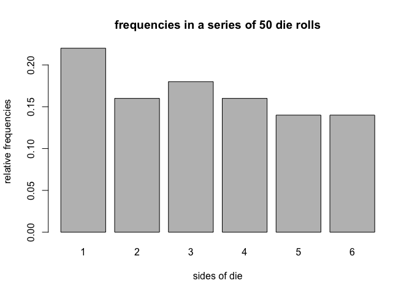
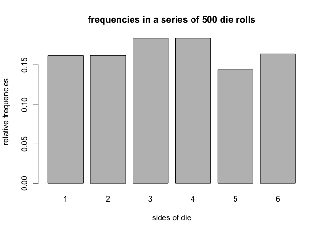

hw05-keqin-cao
================
Keqin Cao
4/16/2018

``` r
library("stringr")
library("dieroller")
set.seed(12)
fair<- die()
repetition<- 1000
sides<- matrix(data = NA, nrow = 1000, ncol = 4)
for (i in 1:repetition) {
  sides[i, ]<- roll(fair, 4)$rolls
  sides<- (sides)
}

counts<- c()
for (i in 1:repetition){
  count<- sum(str_detect(sides[i, ], "6"))
  counts<- append(counts, count)
}
table(counts)/1000
```

    ## counts
    ##     0     1     2     3     4 
    ## 0.485 0.394 0.110 0.010 0.001

``` r
(sum(unname(table(counts)))-unname(table(counts))[1])/1000
```

    ## [1] 0.515

``` r
fair<- die()
```

``` r
set.seed(123)
side<- c(1,2,3,4,5,6)
repetition<- 1000
sides2<- matrix(data = NA, nrow = 1000, ncol = 24)
for (i in 1:repetition) {
  sides2[i, ]<- roll(fair, 24)$rolls
  sides2<- (sides2)
}
  
side3<- c(1,2,3,4,5,6)
repetition<- 1000
sides3<- matrix(data = NA, nrow = 1000, ncol = 24)
for (i in 1:repetition) {
  sides3[i, ]<- roll(fair, 24)$rolls
  sides3<- (sides3)
}

counts3<- vector(mode = "list", length = 1000)
for (i in 1:repetition){
  counts3[[i]]<- str_detect(sides2[i, ], "6")
}

counts4<- vector(mode = "list", length = 1000)
for (i in 1:repetition){
  counts4[[i]]<- str_detect(sides3[i, ], "6")
}

detect_double = c(rep(0,1000))
for(i in 1:repetition){
  for(j in 1:24){
    if((counts3[[i]][j] + counts4[[i]][j] )==2 )
      detect_double[i] = detect_double[i]  + 1
  }
   
 }
 bbb<- table(detect_double)

(sum(unname(bbb))-unname(bbb)[1])/1000
```

    ## [1] 0.493

``` r
#How to use the package Object Die
fair_die <- die()
fair_die
```

    ## object "die"
    ## 
    ##   side      prob
    ## 1    1 0.1666667
    ## 2    2 0.1666667
    ## 3    3 0.1666667
    ## 4    4 0.1666667
    ## 5    5 0.1666667
    ## 6    6 0.1666667

``` r
weird_die <- die(sides = c('i', 'ii', 'iii', 'iv', 'v', 'vi'))
weird_die
```

    ## object "die"
    ## 
    ##   side      prob
    ## 1    i 0.1666667
    ## 2   ii 0.1666667
    ## 3  iii 0.1666667
    ## 4   iv 0.1666667
    ## 5    v 0.1666667
    ## 6   vi 0.1666667

``` r
loaded_die <- die(prob = c(0.075, 0.1, 0.125, 0.15, 0.20, 0.35))
loaded_die
```

    ## object "die"
    ## 
    ##   side  prob
    ## 1    1 0.075
    ## 2    2 0.100
    ## 3    3 0.125
    ## 4    4 0.150
    ## 5    5 0.200
    ## 6    6 0.350

``` r
#How to use the package Object roll
set.seed(123)
fair50 <- roll(fair_die, times = 50)
fair50
```

    ## object "roll"
    ## 
    ## $rolls
    ##  [1] 3 6 4 1 1 2 5 1 5 4 1 4 6 5 2 1 3 2 3 1 1 6 5 1 5 6 5 5 3 2 1 1 6 6 2
    ## [36] 4 6 3 3 3 2 4 4 4 2 2 3 4 3 1

``` r
names(fair50)
```

    ## [1] "rolls" "sides" "prob"  "total"

``` r
fair50$rolls
```

    ##  [1] 3 6 4 1 1 2 5 1 5 4 1 4 6 5 2 1 3 2 3 1 1 6 5 1 5 6 5 5 3 2 1 1 6 6 2
    ## [36] 4 6 3 3 3 2 4 4 4 2 2 3 4 3 1

``` r
fair50$sides
```

    ## [1] 1 2 3 4 5 6

``` r
fair50$prob
```

    ## [1] 0.1666667 0.1666667 0.1666667 0.1666667 0.1666667 0.1666667

``` r
fair50$total
```

    ## [1] 50

``` r
# string die
str_die <- die(
sides = c('a', 'b', 'c', 'd', 'e', 'f'),
prob = c(0.075, 0.1, 0.125, 0.15, 0.20, 0.35))
str_die
```

    ## object "die"
    ## 
    ##   side  prob
    ## 1    a 0.075
    ## 2    b 0.100
    ## 3    c 0.125
    ## 4    d 0.150
    ## 5    e 0.200
    ## 6    f 0.350

``` r
set.seed(123)
str_rolls <- roll(str_die, times = 20)
names(str_rolls)
```

    ## [1] "rolls" "sides" "prob"  "total"

``` r
str_rolls
```

    ## object "roll"
    ## 
    ## $rolls
    ##  [1] "f" "c" "e" "b" "a" "f" "e" "b" "d" "e" "a" "e" "d" "d" "f" "b" "f"
    ## [18] "f" "f" "a"

``` r
#How to use the package summary method Object roll
set.seed(123)
fair_50rolls <- roll(fair_die, times = 50)
fair50_sum <- summary(fair_50rolls)
fair50_sum
```

    ## summary "roll"
    ## 
    ##   side count prop
    ## 1    1    11 0.22
    ## 2    2     8 0.16
    ## 3    3     9 0.18
    ## 4    4     8 0.16
    ## 5    5     7 0.14
    ## 6    6     7 0.14

``` r
# what's in the summary
class(fair50_sum)
```

    ## [1] "summary.roll"

``` r
names(fair50_sum)
```

    ## [1] "freqs"

``` r
fair50_sum$freqs
```

    ##   side count prop
    ## 1    1    11 0.22
    ## 2    2     8 0.16
    ## 3    3     9 0.18
    ## 4    4     8 0.16
    ## 5    5     7 0.14
    ## 6    6     7 0.14

``` r
#How to use package for plot method for roll object
plot(fair_50rolls)
```



``` r
#Additional Methods
# roll fair die
set.seed(123)
fair_die <- die()
fair500 <- roll(fair_die, times = 500)
# summary method
summary(fair500)
```

    ## summary "roll"
    ## 
    ##   side count  prop
    ## 1    1    80 0.160
    ## 2    2    81 0.162
    ## 3    3    92 0.184
    ## 4    4    92 0.184
    ## 5    5    72 0.144
    ## 6    6    83 0.166

``` r
# extracting roll in position 500
fair500[500]
```

    ## [1] 6

``` r
# replacing last roll
fair500[500] <- 1
fair500[500]
```

    ## [1] 1

``` r
summary(fair500)
```

    ## summary "roll"
    ## 
    ##   side count  prop
    ## 1    1    81 0.162
    ## 2    2    81 0.162
    ## 3    3    92 0.184
    ## 4    4    92 0.184
    ## 5    5    72 0.144
    ## 6    6    82 0.164

``` r
# adding 100 rolls
set.seed(123)
fair600 <- fair500 + 100
fair600[500] <- 1
summary(fair600)
```

    ## summary "roll"
    ## 
    ##   side count      prop
    ## 1    1   100 0.1666667
    ## 2    2    97 0.1616667
    ## 3    3   104 0.1733333
    ## 4    4   109 0.1816667
    ## 5    5    91 0.1516667
    ## 6    6    99 0.1650000

``` r
# plot method
plot(fair500, 500)
```


